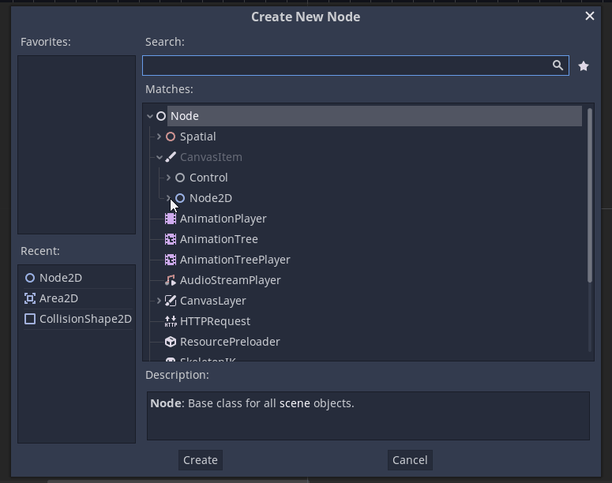
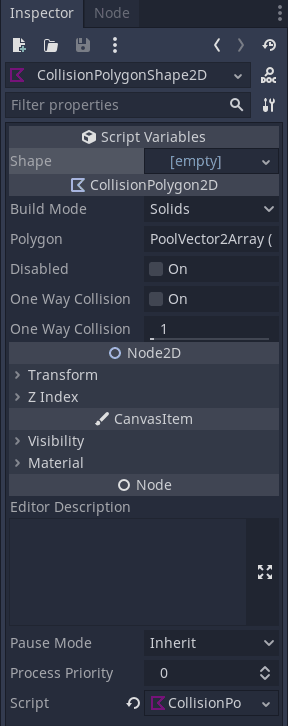
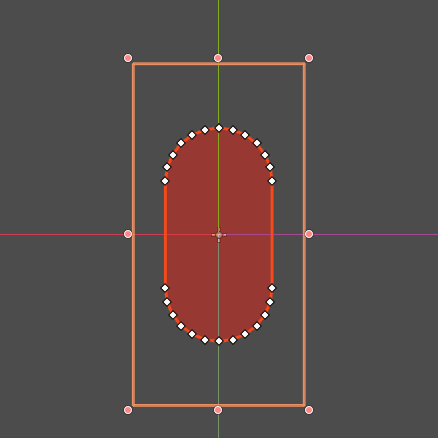
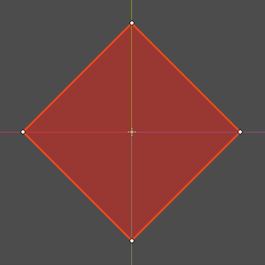

# CollisionPolygonShape
**CollisionPolygon with predefined shapes just like CollisionShape**

|                   |                              |
|-------------------|------------------------------|
| **Author**        | Jakub **Kubulambula** Janšta |
| **Version**       | 1.1                          |
| **Godot Version** | 3.4.3-stable                 |
| **License**       | MIT                          |
|                   |                              |

## Why
Godot's Shape node is very useful, but for example if you want to find the area of intersection between two shapes you would most likely use the [Geometry](https://docs.godotengine.org/en/3.4/classes/class_geometry.html?highlight=Geometry) singleton.  
But this uses polygons as [PoolVector2Arrays](https://docs.godotengine.org/en/3.4/classes/class_poolvector2array.html?highlight=poolvector2array) and [CollisionPolygon2D](https://docs.godotengine.org/en/3.4/classes/class_collisionpolygon2d.html?highlight=collisionPolygon2D) node does not have shape presets while [CollisionShape2D](https://docs.godotengine.org/en/3.4/classes/class_collisionshape2d.html#class-collisionshape2d) does not have it's polygon exposed.

This plugin addresses this issue by ading new **CollisionPolygonShape2D** Node and **PolygonShape2D** Resources 

## How to use it
* Just create a new **CollisionPolygonShape2D** Node like any other (under [CollisionPolygon2D](https://docs.godotengine.org/en/3.4/classes/class_collisionpolygon2d.html?highlight=collisionPolygon2D)) and in the inspector add a **PolygonShape2D** just as if it was [CollisionShape2D](https://docs.godotengine.org/en/3.4/classes/class_collisionshape2d.html#class-collisionshape2d).
* The Node functions just like [CollisionPolygon2D](https://docs.godotengine.org/en/3.4/classes/class_collisionpolygon2d.html?highlight=collisionPolygon2D).
* If you want to get the **PolygonShape2D**'s polygon just call `get_polygon()` method on it returning [PoolVector2Array](https://docs.godotengine.org/en/3.4/classes/class_poolvector2array.html?highlight=poolvector2array).
    * `CollisionPolygonShape2D.shape.get_polygon()`

## License
This plugin is released under the **MIT license**.
See [LICENSE](https://github.com/Kubulambula/Godot-CollisionPolygonShape/blob/main/LICENSE)

## Disclaimer :warning:   
There is **no warranty** for any issue or bug that may break or corrupt your project.  
It is advisable to keep a copy of your project.
